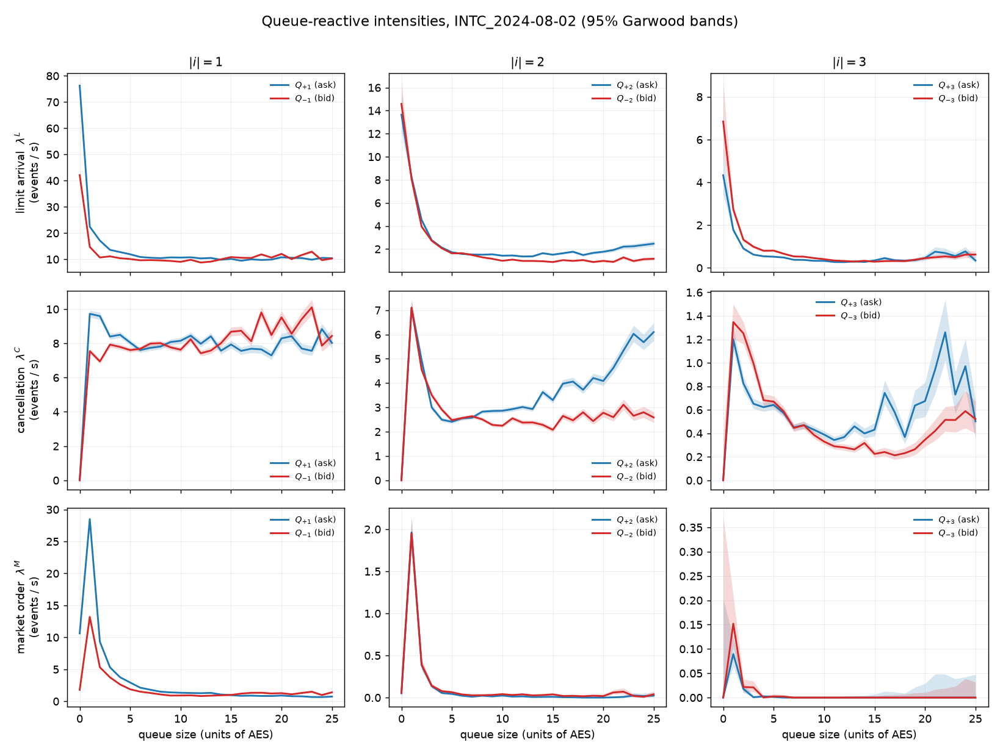
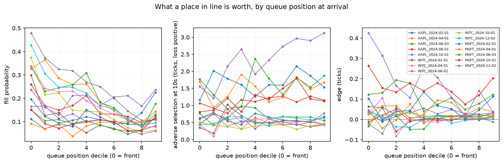
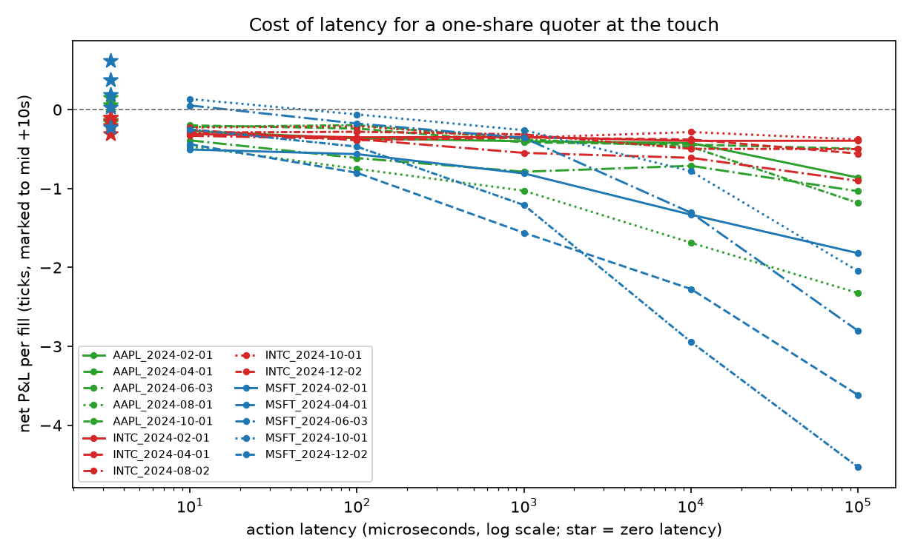
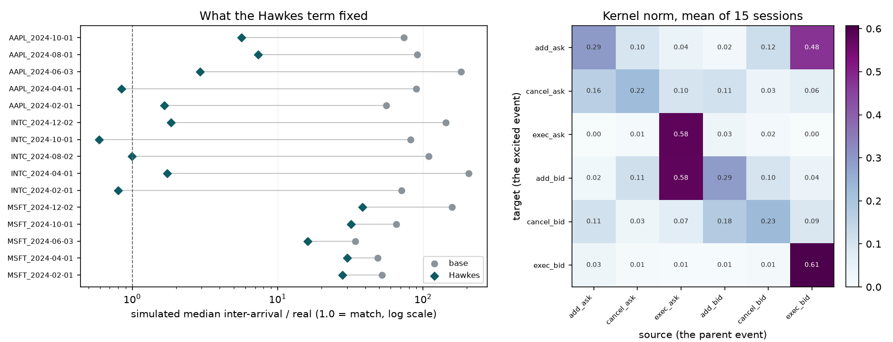
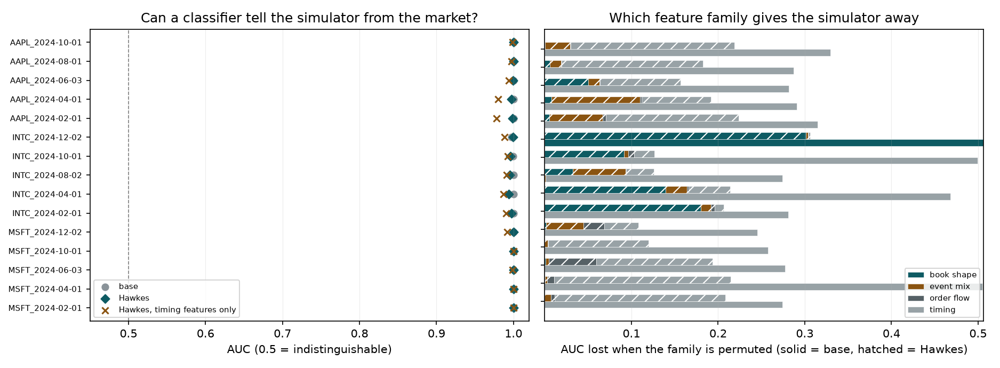

# Real-Time Limit Order Book Engine in C++

This repository implements a small, deterministic C++ limit-order-book engine for LOBSTER-style message data. The parser and replay code operate on the LOBSTER six-column message schema, but the checked-in CSVs are tiny synthetic/reduced fixtures for reproducibility, not full proprietary LOBSTER distributions. The repo includes:

- typed CSV ingestion for LOBSTER message rows
- order lifecycle processing for add, cancel, and execute events
- aggregated bid/ask levels plus order-ID lookup
- two price-level backends: `std::map` and flat sorted `std::vector`
- rolling analytics and CSV export after every processed message
- optional post-replay prediction summary reporting by message horizon
- deterministic C++ and Python integration tests
- replay benchmark tooling and a hand-maintained benchmark reproducibility note
- a vendor cross-check that reaches exact MBP-10 agreement on two Databento
  sessions, and a LOB-Bench run as an outside second opinion
- a calibrated queue-reactive model (Huang-Lehalle-Rosenbaum) fitted on the
  reconstructed books, with the places it breaks measured rather than asserted
- four studies the exact book makes possible: a price for queue position, a
  price for latency, a Hawkes fix for the simulator's timing, and a classifier
  that tries to tell the simulator from the market

## The sample, stated once

**Fifteen symbol-days on three names, all in 2024: MSFT, INTC and AAPL.**
The sample was not drawn at random. There was no complete external audit of
market stress, halts or index events, so absence of those events is not claimed.

`INTC 2024-08-02` is an identified single-name event day, the session
after Intel's Q2 report and dividend suspension. It is kept because it is
genuinely different, and it is flagged wherever it behaves differently.

**Nothing below is a population or a regime claim.** A sentence here may say
what was measured on Microsoft, Intel or Apple on these days. It may not say
what is true of large-tick names, of small-tick names, or of Nasdaq stocks,
because three names on selected days cannot support that and no amount of
careful phrasing makes them. Where a statement holds on some sessions and not
others, the count is given.

Session list, record counts and cost are in [DATA.md](DATA.md).

## Verify the research in five minutes

**The same fifteen symbol-days, three names, 2024.** The aggregate evidence is
now published as CSVs; no credentials are needed to check the arithmetic.

```bash
python scripts/verify_evidence.py --check
```

| claim | verified from published aggregates |
|---|---:|
| absolute front-minus-back edge below 0.05 tick | **12 of 15 sessions**, corrected from 14 |
| Hawkes median inter-arrival within a factor of two of real | 7 of 15 |
| Hawkes timing distance improves | 15 of 15, mean L1 0.678310 to 0.315927 |
| Hawkes touch-queue ratio moves further from one | 13 of 15 |
| smallest classifier AUC against Hawkes | **0.993939** |

[All eleven verified claims](report/evidence/claims.csv),
[eighty-file aggregate manifest](report/evidence_manifest.csv),
[audit protocol and limits](docs/evidence_audit.md), and
[primary literature through 2026-09-06](docs/literature_audit_2026.md).
The CSVs were recovered from existing local analysis outputs and published
without a new fit. Their hashes establish integrity, not a fresh reconstruction
from the licensed feed. Historical tables without surviving machine output are
explicitly archived as [README transcriptions](report/readme_tables/index.csv),
which do not independently prove those measurements.

**What did not work:** improving every session's timing distribution did not
produce a realistic simulator. Every fitted Hawkes stream remains easy to
classify, and queue realism worsens on most sessions. The corrected queue count
also leaves three, not one, differences above 0.05 tick.

## Repository layout

- `include/lob/`: public headers for parsing, order book state, replay, and analytics
- `src/`: parser, order book engine, replay, analytics, and CLI entrypoint
- `tests/`: C++ unit tests plus Python integration coverage for the CMake workflow
- `benchmark/`: replay benchmark harness
- `data/`: checked-in small sample datasets used for deterministic tests and reproducible benchmark captures
- `report/`: benchmark and methodology notes

## Reproducible build

From a fresh clone, run the build, verifier, and benchmark commands below in order. Start with a clean temporary build directory instead of an in-repo build tree:

```bash
build_dir="$(mktemp -d "${TMPDIR:-/tmp}/lob-engine-build.XXXXXX")"
cmake -S . -B "$build_dir" -DCMAKE_BUILD_TYPE=Release
cmake --build "$build_dir" --config Release
```

## Correctness verification

Run the CMake/CTest verifier from that build directory, then run the existing Python test suite from the repo root:

```bash
ctest --test-dir "$build_dir" --output-on-failure -C Release
python -m pytest tests -q --tb=short
```

`ctest` runs the three C++ test executables plus the `lob_benchmark_smoke` path. `python -m pytest tests -q --tb=short` configures and reuses a separate `.cmake-test-build/` directory under the repo root; that directory and the analytics CSVs produced there are ignored local test artifacts.

## CLI usage

Replay a dataset and print final top-of-book state:

```bash
"$build_dir/lob_engine" data/AAPL_sample_messages.csv --backend both --depth 10 --repeat 5
```

Export analytics rows after every processed message:

```bash
"$build_dir/lob_engine" \
  data/AAPL_sample_messages.csv \
  --backend both \
  --analytics-out "$build_dir/analytics.csv" \
  --trade-window-messages 1000 \
  --realized-vol-window-seconds 300
```

If `--backend both` is selected, the CLI writes one CSV per backend by suffixing the output path.

Emit a separate prediction summary after replay without changing the analytics CSV rows:

```bash
"$build_dir/lob_engine" \
  data/AAPL_sample_messages.csv \
  --backend map \
  --analytics-out "$build_dir/analytics.csv" \
  --prediction-report-out "$build_dir/prediction_report.csv" \
  --prediction-horizons 100,500
```

`--prediction-report-out` requires `--prediction-horizons`. If both flags are omitted, prediction work stays disabled.

Seed the opening book from the first row of a LOBSTER orderbook file (message streams begin at 09:30 and reference pre-open resting orders; see Real-data validation below):

```bash
"$build_dir/lob_engine" MSFT_message_10.csv --backend map --seed-book MSFT_orderbook_10.csv --analytics-out analytics.csv
```

## Analytics

Each processed message produces a row with:

- `timestamp`
- `best_bid`, `best_ask`, `spread`, `mid`
- `bid_depth_{1,5,10}`, `ask_depth_{1,5,10}`
- `order_imbalance`
- `rolling_vwap`
- `trade_flow_imbalance`
- `rolling_realized_vol`
- `ofi_event`, `rolling_ofi`

`ofi_event` is the L1 order flow imbalance of Cont, Kukanov and Stoikov (2014), computed per message from best-quote transitions: `e_n = 1{Pb >= Pb'} qb - 1{Pb <= Pb'} qb' - 1{Pa <= Pa'} qa + 1{Pa >= Pa'} qa'`. A vanished side contributes as a move away from the touch, and the first observed book contributes zero (state, not flow). `rolling_ofi` sums `e_n` over the trailing `trade_window_messages` events. OFI and the static depth imbalance answer different questions: on the LOBSTER sample day below, OFI is by far the stronger *contemporaneous* impact variable (the CKS result) while depth imbalance is the better *predictor* of the next mid move, so both are exported and the comparison is reproducible via `scripts/ofi_predictive_power.py`. Hand-computed transition sequences are covered in `test_analytics`.

The default rolling windows match the project objective:

- trailing `1000` messages for trade-based metrics
- trailing `300` seconds for realized volatility

Prediction reporting is a separate CSV keyed by message horizon. For each row `t`, the label is the sign of the first non-zero mid-price move found in `t+1 ... t+H` relative to mid at `t`. Rows with invalid current mid or no non-zero future move inside the horizon are skipped. The report includes labeled sample counts, up/down move counts, hit rate from `sign(order_imbalance_top5)` on non-zero-signal rows, and information coefficient computed as the Pearson correlation between the raw top-5 imbalance value and the future move sign. Zero-signal rows stay in the labeled sample and IC calculation but increment `skipped_zero_signal` so they are excluded from the hit-rate denominator.

## Backends

Two backends are implemented behind the same `OrderBook` interface:

- `map`
  - sorted levels via `std::map`
  - stable `O(log n)` insert/update/remove at the level container
- `flat`
  - sorted levels in a binary-searched `std::vector`
  - better cache locality on shallow books
  - more expensive interior insert/erase at larger active depth

Deterministic parity tests assert that both backends produce identical book snapshots after each message in the shared test sequences.

## Benchmarking

The checked-in benchmark numbers below come from the existing `lob_benchmark` replay harness in `Release` mode. The timer still covers replay/book updates, not CSV export. Analytics correctness and backend parity stay covered by `test_analytics`, and the CLI analytics path now shares the same derived book reserve hints plus pre-sized rolling buffers.

Exact hot-path allocation changes in this branch:

- derive `expected_orders` from the peak active-order count in the parsed message stream before replay instead of hard-coding `messages.size()`
- derive `expected_levels_per_side` from the peak active bid/ask level count instead of hard-coding `64`
- pre-size the rolling trade window and realized-vol sample buffer in analytics, and retain that capacity across `AnalyticsEngine::reset()`
- construct `AnalyticsRow` values in place during replay instead of pushing a temporary row object per message

Measurement method used for the recorded table:

- baseline tree: clean `origin/main` checkout at `d627b73`
- optimized tree: this worktree after the reserve/buffer changes below
- build: `cmake -S . -B "$build_dir" -DCMAKE_BUILD_TYPE=Release && cmake --build "$build_dir" --config Release`
- warmup: one untimed `taskset -c 0 "$build_dir/lob_benchmark" --dataset data/AAPL_sample_messages.csv --backend both --reserve on --depth 5 --repeat 10000`
- measured commands: the four `taskset -c 0 "$build_dir/lob_benchmark" --dataset ... --backend both --reserve on --depth 5 --repeat 100000` invocations listed below
- host: Linux 6.8.0-106-generic, `g++ 13.3.0`, AMD EPYC-Rome Processor, benchmark process pinned to CPU 0

These four commands are the recorded measurement step:

```bash
taskset -c 0 "$build_dir/lob_benchmark" --dataset data/AAPL_sample_messages.csv --backend both --reserve on --depth 5 --repeat 100000
taskset -c 0 "$build_dir/lob_benchmark" --dataset data/MSFT_sample_messages.csv --backend both --reserve on --depth 5 --repeat 100000
taskset -c 0 "$build_dir/lob_benchmark" --dataset data/NVDA_sample_messages.csv --backend both --reserve on --depth 5 --repeat 100000
taskset -c 0 "$build_dir/lob_benchmark" --dataset data/TSLA_sample_messages.csv --backend both --reserve on --depth 5 --repeat 100000
```

On the optimized tree, `lob_benchmark` now prints the derived reserve hints alongside each run. For the four checked-in ticker fixtures, the derived replay hints are `expected_orders=3` and `expected_levels_per_side=3`.

Recorded throughput on this host:

| Dataset | Backend | Baseline elapsed ms | Baseline msgs/sec | Optimized elapsed ms | Optimized msgs/sec | Delta |
| --- | --- | ---: | ---: | ---: | ---: | ---: |
| `AAPL` | `map` | 39.272 | 50,926,679.688 | 32.665 | 61,228,168.484 | +20.23% |
| `AAPL` | `flat_vector` | 36.477 | 54,829,135.007 | 30.653 | 65,245,476.645 | +19.00% |
| `MSFT` | `map` | 34.837 | 57,409,888.578 | 33.477 | 59,743,302.149 | +4.06% |
| `MSFT` | `flat_vector` | 36.481 | 54,822,944.367 | 30.856 | 64,816,866.749 | +18.23% |
| `NVDA` | `map` | 37.224 | 53,729,301.089 | 33.445 | 59,799,408.267 | +11.30% |
| `NVDA` | `flat_vector` | 37.173 | 53,801,878.832 | 32.955 | 60,689,226.916 | +12.80% |
| `TSLA` | `map` | 34.614 | 57,780,646.523 | 33.194 | 60,252,569.734 | +4.28% |
| `TSLA` | `flat_vector` | 36.451 | 54,868,240.915 | 31.245 | 64,010,909.507 | +16.66% |

Post-optimization backend comparison on these fixtures:

- `flat_vector` remains faster than `map` on all four reduced ticker fixtures after the change: +6.56% on `AAPL`, +8.49% on `MSFT`, +1.49% on `NVDA`, and +6.24% on `TSLA`
- the margin stays narrow because these fixtures top out at three active orders and three active levels per side after malformed rows are dropped
- these numbers are local measurements on tiny synthetic fixtures; do not generalize them to deeper books or proprietary full-session datasets

`--reserve on` enables:

- auto-derived `unordered_map::reserve()` sizing for order lookup
- auto-derived vector capacity reservation for the flat backend price-level storage

This is the bounded hot-path allocation reduction implemented in the repo. Throughput numbers are host-dependent and should be treated as local measurements on the checked-in reduced fixtures, not as publishable claims about full vendor datasets. See `report/benchmark_report.md` for the exact datasets and commands used for reproducible reruns.

## Dataset note

The repo ships five checked-in reproducibility fixtures:

- `AAPL_sample_messages.csv`
- `MSFT_sample_messages.csv`
- `NVDA_sample_messages.csv`
- `TSLA_sample_messages.csv`
- `sample_messages.csv`

The four ticker-named files are 25-line reduced fixtures with 20 valid messages plus 5 intentionally malformed rows each. `sample_messages.csv` is a legacy generic fixture with the same contents as `AAPL_sample_messages.csv`, kept because the parser and Python integration tests reference it directly.

These files are intentionally tiny and deterministic so the build, tests, and benchmark workflow can run on a fresh clone without external data dependencies. They are suitable for correctness checks and relative replay comparisons, not production-grade market simulation or claims about full vendor data.

## Real-data validation (LOBSTER sample day, 2026-08)

The engine was run against the canonical LOBSTER sample day (MSFT
2012-06-21, level 10: 668,765 messages, level-10 orderbook file alongside).
The files are not checked in (~200 MB); they are the standard LOBSTER
academic sample, mirrored in several public research repos.

**Replay**: all 668,765 messages parse with 0 malformed rows.

## Vendor cross-check: exact agreement on MBP-10, two sessions (2026-09)

Databento derives every schema from MBO, so their MBP-10 and a book built here
from their MBO are two independent derivations of one source. Agreement is a
real correctness check on the book logic rather than a self-consistency check.

`scripts/validate_mbp10_vs_vendor.py` diffs them, aligned exactly on the venue
`sequence` (many MBO events share a `ts_recv`, so timestamp matching compares
the engine at a different point in the stream and manufactures disagreement).

**Result: 100.0000% of compared cells match on both sessions** - every cell, at
every one of the ten levels, under both alignments.

| quantity | MSFT 2024-06-03 | INTC 2024-08-02 |
|---|---:|---:|
| MBO records in | 4,003,834 | 2,356,988 |
| LOBSTER messages out | 3,862,854 | 2,051,624 |
| malformed rows | 0 | 0 |
| **agreement** | **100.0000%** | **100.0000%** |
| cells compared | 53,551,466 | 60,128,762 |
| - vendor `A`/`C`/`F` vs engine post-event | 49,611,426 | 51,939,050 |
| - vendor `T` prints vs engine pre-fill | 3,940,040 | 8,189,712 |
| slots where both agree the level is absent | 734 | 4,638 |
| **slots where one side sees a level and the other does not** | **0** | **0** |

Nothing is excluded to reach either number. The last row is the one that keeps
the percentage honest: a figure computed over mutually-present cells could hide
a disagreement about whether a level exists at all, so every slot is accounted
for explicitly and the validator prints that reconciliation.

### The second session is a different kind of book

A second MSFT day would mostly re-test the same book. INTC on 2024-08-02 - the
session after Intel's Q2 report, where the repricing arrived as an overnight gap
 -  is large-tick and queue-dominated where MSFT is small-tick and
spread-dominated, measured on the engine's own L1 output over RTH:

| quantity | MSFT 2024-06-03 | INTC 2024-08-02 |
|---|---:|---:|
| RTH mid, open → close | 415.63 → 413.64 | 21.95 → 21.48 |
| one tick, in bp of mid | 0.24 bp | 4.73 bp |
| median spread | $0.05 (1.21 bp) | $0.01 (4.73 bp) |
| share of session at a one-tick spread | 1.0% | 81.1% |
| median touch size, bid / ask | 68 / 63 | 2,415 / 3,000 |
| displayed fills | 70,510 | 152,683 |

INTC carries **2.2x the displayed fills on 53% of the message count** and a touch
roughly 35-48x deeper. Whatever the engine gets right, it is not getting right by
being tuned to one book shape.

The two fixes in the engine's input (below) were found on MSFT and applied
unchanged to INTC, which reached 100.0000% on the first run with no further
work. That is the useful part: they were corrections to a misread of the vendor's
event model, not adjustments fitted to one session. On INTC the mirror-cancel
dedup matches **152,683 of 152,683** fills, the same 100% the `order_id` key
gives on MSFT.

Getting to the first of those numbers took three fixes, two in the engine's input
and one in the harness that measures it. The sequence is the point: each wrong
answer was disproved by a test rather than argued away.

**1. Execution double-count (98.23% → 99.74%).** **Databento emits three MBO
records for one displayed execution**: a `T` print, an `F` fill against the
resting order, and a `C` removing that same quantity from the book. Applying
both reduced the resting order twice, which is why engine depth ran
systematically below the vendor's - smaller in 87,583 of 98,102 mismatches. That
is the same duplication as the `T`/`F` pair one layer deeper, and it is
invisible without a vendor-derived book to diff against.

**2. Mixed snapshot conventions in the harness (99.74% → 99.9938%).** An earlier
version of this section attributed the residual 0.26% to the vendor reporting
the pre-trade book while the engine reported post-trade. That was wrong, and
testing it is what found the real cause: rolling the engine back to its
pre-trade state made agreement *worse*, 99.74% → 99.17%.

The vendor's MBP-10 contains essentially no `F` rows (3 in the entire session).
It represents a displayed execution as a `T` print followed by a `C` removal,
and those two rows carry **different book states** - `T` the book before the
execution, `C` the book after. Trade sequences split 60,292 emitting only `(T,)`
against 38,209 emitting `(T, C)`, so keeping the last vendor row per sequence
compared against a post-trade snapshot on some sequences and a pre-trade
snapshot on others. Aligned on the right row, the vendor's `C` row matched the
engine's post-fill state on 100.000% of ask cells. The giveaway was the 3,001
fills that fully consumed the touch: the vendor still showed the consumed price
in **3,001 of 3,001**.

**3. The dedup was keyed on the wrong field (99.9938% → 100.0000%).** The mirror
cancel was matched on `(sequence, price, size)`, which catches 70,254 of 70,510
fills - 99.64%, close enough to look finished. Each of the **256 misses** left a
cancel in the stream that double-decremented a resting order, and the book then
carried that error until the order left. A handful of events produced 3,321
mismatched cells across 1,886 sequences, 1,585 of which were single-record
sequences merely downstream of the damage.

Keying on `(sequence, order_id)` matches **70,510 of 70,510**, because the fill
names the resting order it executed against and the mirror cancel removes
quantity from that same order - so the pair necessarily agrees on the id, while
price and size are only a proxy for it.

What made this findable was measuring distance rather than inspecting cases:
mismatched sequences sat a median **15,055 sequences after the nearest dedup
miss**, against **4,683,657** for sequences that agreed. Two competing
explanations were tested and rejected first - modify records (there are none in
this session) and multi-record sequence ordering, which turned out to be
*under*-represented among the mismatches at 0.3×, and that is what redirected
the search toward downstream drift.

Also ruled out: general cancel semantics (1,925,732 cancels, zero over-cancels)
and price truncation (zero sub-penny prices, so the fixed-point conversion is
lossless).

Reproduce either session end to end (`--confirm` is what actually spends):

```bash
python scripts/fetch_databento_session.py --symbol INTC --date 2024-08-02 --confirm
python scripts/databento_to_lobster.py data/databento/INTC_2024-08-02_mbo.dbn.zst \
    --out data/databento/INTC_2024-08-02_message.csv \
    --sequence-out data/databento/INTC_2024-08-02_seq.csv
build/lob_engine data/databento/INTC_2024-08-02_message.csv \
    --backend map --depth 10 --book-out data/databento/INTC_2024-08-02_book10.csv
python scripts/validate_mbp10_vs_vendor.py \
    --engine-book data/databento/INTC_2024-08-02_book10.csv \
    --vendor data/databento/INTC_2024-08-02_mbp10.dbn.zst \
    --sequences data/databento/INTC_2024-08-02_seq.csv \
    --messages data/databento/INTC_2024-08-02_message.csv
```

## Second opinion: LOB-Bench (2026-09)

The cell diff above is this repo marking its own homework - our alignment, our
comparison, our tolerance. [LOB-Bench](https://github.com/peernagy/lob_bench)
(Nagy et al., ICML 2025) is the standard evaluation suite for LOB generative
models, and running the engine's output through it substitutes someone else's
metric implementations for ours.

`scripts/run_lob_bench.py` maps the engine's reconstructed book to LOB-Bench's
"generated" side and Databento's own MBP-10 to its "real" side, cuts the session
into 100 windows of 4,096 messages spread across RTH, and reports L1 and
Wasserstein-1 distances between the two distributions.

**Every statistic scores 0.000000 on both sessions**, on both metrics:

| statistic | MSFT 2024-06-03 | INTC 2024-08-02 |
|---|---:|---:|
| spread | 0.000000 | 0.000000 |
| orderbook imbalance | 0.000000 | 0.000000 |
| ask / bid volume at touch | 0.000000 | 0.000000 |
| ask / bid volume over 10 levels | 0.000000 | 0.000000 |
| limit order depth, ask / bid | 0.000000 | 0.000000 |
| cancellation depth, ask / bid | 0.000000 | 0.000000 |
| log inter-arrival time | 0.000000 | 0.000000 |
| log time to cancel | 0.000000 | 0.000000 |

**What this does and does not establish.** Both sides consume the same message
stream, so where cell agreement is already exact these zeros are exact *by
construction*. This is not independent evidence that the engine produces
realistic markets - it cannot be, and reading it that way would be the mistake
the table exists to avoid. What it does establish is two things the cell diff
does not:

1. **The engine's LOBSTER export is well-formed enough for the standard academic
   toolchain to consume unmodified**, through a third-party parser rather than
   ours - including the message-derived statistics (inter-arrival, time to
   cancel) that the MBP-10 diff never touches.
2. **It is a regression check with real teeth.** Any non-zero entry would mean
   the books differ somewhere the cell diff did not look, or that the export is
   malformed. Building it caught exactly that class of bug in the harness: the
   vendor's dollar prices scale to values like `215899.99999999997`, and
   truncating rather than rounding on the integer cast manufactured a one-tick
   disagreement on nearly every price cell (`spread` L1 0.172, cancellation
   depth 0.119) while leaving every size-derived statistic at zero. The diff
   tolerates that with `atol=0.5`; an integer export has to round.

```bash
python scripts/run_lob_bench.py \
    --engine-book data/databento/INTC_2024-08-02_book10.csv \
    --vendor data/databento/INTC_2024-08-02_mbp10.dbn.zst \
    --sequences data/databento/INTC_2024-08-02_seq.csv \
    --messages data/databento/INTC_2024-08-02_message.csv \
    --symbol INTC --date 2024-08-02 \
    --lob-bench <clone of peernagy/lob_bench> --work-dir /tmp/lobbench_intc \
    --out report/lob_bench_INTC_2024-08-02.csv
```

`--out` writes the full score table. The two aggregate score CSVs are now
committed under `report/`; generated raw-message and book intermediates remain
local. See the evidence manifest for their provenance.

## Queue-reactive calibration (2026-09)

Everything above reconstructs books. This is the repository's first *fitted
model*: the queue-reactive model of Huang, Lehalle and Rosenbaum
([JASA 2015](https://arxiv.org/abs/1312.0563)), in which the book is a Markov
queueing system of 2K queues sitting at fixed offsets from a reference price,
and the intensity of limit-order arrival, cancellation and market-order flow at
each queue is a function of that queue's own size.

The geometry is the part that is easy to get wrong, and it carries the model.
Queue `Q_i` sits `(|i| - 0.5)` ticks from `p_ref`, **not** at a fixed offset from
the best quote. That is what lets `Q_1` be genuinely empty when the spread
widens, and what makes "market orders reach `Q_2` only once `Q_1` has emptied" a
statement the model can express at all. Because limit prices are whole ticks and
the queues sit half a tick off `p_ref`, `p_ref` is always an odd multiple of half
a tick and the whole geometry is exact in integers.

### Where the model's assumptions hold, across fifteen sessions

The queue-reactive model is built around a book whose spread is usually one
tick: Huang, Lehalle and Rosenbaum calibrate it on stocks where that holds, and
its K = 3 queues sit within three ticks of the reference price by construction.
Fifteen sessions make the consequence measurable rather than a caveat.

| session | median spread | best quote inside the +/-3 window | events on a modelled queue | AES at the touch (ask/bid) | `p_ref` moves | depletions | implied theta |
|---|---:|---:|---:|---:|---:|---:|---:|
| MSFT 2024-02-01 | 4 ticks | 84.6% | 11.2% | 69 / 73 | 99,875 | 32,159 | **3.11** |
| MSFT 2024-04-01 | 4 ticks | 89.4% | 13.8% | 68 / 73 | 74,502 | 28,360 | **2.63** |
| MSFT 2024-06-03 | 5 ticks | 70.8% | 12.7% | 56 / 56 | 60,597 | 8,260 | **7.34** |
| MSFT 2024-10-01 | 5 ticks | 64.2% | 11.4% | 37 / 36 | 110,537 | 15,073 | **7.33** |
| MSFT 2024-12-02 | 6 ticks | 55.7% | 6.6% | 61 / 49 | 38,955 | 5,637 | **6.91** |
| INTC 2024-02-01 | 1 tick | 100.0% | 71.0% | 223 / 235 | 6,790 | 12,099 | 0.56 |
| INTC 2024-04-01 | 1 tick | 100.0% | 71.0% | 143 / 147 | 4,880 | 9,688 | 0.50 |
| INTC 2024-08-02 | 1 tick | 100.0% | 64.8% | 370 / 301 | 13,170 | 26,044 | 0.51 |
| INTC 2024-10-01 | 1 tick | 100.0% | 71.4% | 411 / 416 | 4,300 | 7,215 | 0.60 |
| INTC 2024-12-02 | 1 tick | 100.0% | 62.6% | 386 / 373 | 6,990 | 12,090 | 0.58 |
| AAPL 2024-02-01 | 1 tick | 99.8% | 37.4% | 78 / 79 | 47,652 | 66,805 | 0.71 |
| AAPL 2024-04-01 | 1 tick | 100.0% | 50.3% | 103 / 103 | 14,865 | 22,686 | 0.66 |
| AAPL 2024-06-03 | 1 tick | 100.0% | 41.1% | 79 / 81 | 36,938 | 68,966 | 0.54 |
| AAPL 2024-08-01 | 2 ticks | 99.7% | 30.0% | 63 / 64 | 67,885 | 88,833 | 0.76 |
| AAPL 2024-10-01 | 2 ticks | 100.0% | 32.3% | 44 / 45 | 91,653 | 190,127 | 0.48 |

| stock | median spread | inside the window | implied theta | theta is a valid probability on |
|---|---|---|---|---:|
| MSFT | 4 to 6 ticks | 55.7 to 89.4% | 2.63 to 7.34 | **0 of 5** |
| INTC | 1 tick | 100.0% | 0.50 to 0.60 | 5 of 5 |
| AAPL | 1 to 2 ticks | 99.7 to 100.0% | 0.48 to 0.76 | 5 of 5 |

**Theta is the sharpest diagnostic, and it splits the sample cleanly.** In the
paper's Model III the reference price moves *with probability theta* when a best
queue empties, so theta is a probability and must lie in [0, 1]. It does on all
ten sessions whose median spread is one or two ticks, and on none of the five
where it is four to six: on MSFT the price moves two to seven times more often
than a modelled queue empties, because the best quote spends 10 to 44% of the
session outside the +/-3 window entirely and moves for reasons the model cannot
see. An impossible probability is the model failing loudly rather than quietly,
and it says more than any goodness-of-fit number would.

Two things worth noting before this is read as a fact about tick size. AAPL
trades near $200 and INTC near $21, an order of magnitude apart, and they land
on the same side; what they share is a spread of one to two ticks, not a price.
And the split here is between three names on fifteen days, which is a
description of these sessions and not a rule about stocks.

Everything below is reported on INTC 2024-08-02, with MSFT 2024-06-03 kept as
the negative control, because those are the two sessions the earlier version of
this section was written on.

### Intensities



Rates are `N / T` - events at a queue while it held a given size, over seconds of
exposure to that size - which is the MLE for a Markov jump process. Bands are
exact Garwood Poisson intervals, chosen over a normal approximation because the
interesting part of these curves is the sparse large-queue tail where a Wald
interval would dip below zero. Sizes are in units of AES, the average event size
at that queue, with `n = 0` reserved for a genuinely empty queue rather than
merely a thin one: the whole price-move mechanism keys on emptiness, so lumping
it in with "less than half an AES" would blur exactly the state that matters.

Two of the three stylized facts reproduce, and the third does not:

1. **Execution is concentrated at the touch, sharply.** Peak `λ^M` runs
   **28.50 / s at Q₊₁, 1.96 at Q₊₂, 0.09 at Q₊₃** - a 15× drop to the second
   level and over 300× to the third. Deeper queues only trade once the ones in
   front are gone, which is the mechanism the p_ref-relative geometry exists to
   express.
2. **Limit arrival falls with queue size**, steeply: at Q₊₁, `λ^L` goes from
   76.3 / s at an empty queue to ~10.6 / s once five or more AES are resting.
   This is where the calibration departs from the paper, which reports `λ^L` at
   Q₊₁ as *roughly constant with a significantly smaller value at zero*. Here it
   is the reverse - much **larger** at zero - and the reason is structural: on a
   one-tick-spread name an empty Q₊₁ means the spread has widened, so posting
   there improves the quote and captures priority. The paper's stocks queue
   differently.
3. **Cancellation is not proportional to queue size, and it is not close.**
   The natural null - every resting order cancels independently at some constant
   hazard - predicts `λ^C ∝ n`. Measured at Q₊₁, `corr(n, λ^C) = −0.425`, and the
   per-order cancellation rate `λ^C / n` **falls from 9.73 to 0.321 between n = 1
   and n = 25**, a thirty-fold collapse. Cancellation is roughly flat in absolute
   terms above n ≈ 3. A long queue is a queue traders want to stay in, and the
   individual order's propensity to leave drops accordingly.

### Simulated versus real

Simulating the fitted model for a full session and comparing against the real
one. Distances are Wasserstein-1 and total variation between the two
distributions.

On INTC 2024-08-02:

| statistic | real | simulated | W₁ | TV |
|---|---:|---:|---:|---:|
| mean inter-arrival (ms) | 20.92 | 14.84 | 1.43 | 0.59 |
| **median inter-arrival (ms)** | **0.057** | **6.23** | | |
| mean queue at Q₁ (AES) | 17.75 | 60.90 | 44.45 | 0.34 |
| median queue at Q₁ (AES) | 11.0 | 19.0 | | |
| mean spread (ticks) | 1.208 | 1.296 | 0.12 | 0.12 |
| median spread (ticks) | 1.0 | 1.0 | | |
| 1s mid move sd (ticks) | 0.707 | 0.379 | 0.14 | 0.07 |

Across all fifteen sessions, as ratios of simulated to real, so 1.00x is a match:

| stock | median inter-arrival | mean queue at Q₁ | mean spread | 1s mid move sd |
|---|---|---|---|---|
| MSFT | 34 to 158x | 4.0 to 13.4x | 0.58 to 0.79x | 0.46 to 0.58x |
| INTC | 71 to 206x | 3.4 to 13.4x | 0.89 to 1.20x | 0.11 to 0.70x |
| AAPL | 56 to 182x | 1.1 to 1.6x | 0.86 to 0.95x | 0.47 to 0.57x |

**The spread is the one thing the model gets close on**, within 20% on 10 of 15
sessions and within a factor of two on all fifteen. Every other row is off in an
informative direction, and in the same direction on every session: too few
events, too much queue, too little volatility. The queue-size error is smallest
on AAPL (1.1 to 1.6x) and largest on MSFT and INTC, which is worth noting given
that AAPL is the name whose theta is closest to the middle of its valid range.

#### Scored again with LOB-Bench

The same suite the reconstruction was scored against
[above](#second-opinion-lob-bench-2026-09), now with the *simulated* book as the
"generated" side and the real one as "real". Both sides are written at K = 3
levels rather than padding the model's output out to ten with fabricated
emptiness - LOB-Bench's own `cut_data_to_lvl` does the same to real data, so
this is its intended shape.

| statistic | INTC L1 | INTC W₁ | MSFT L1 | MSFT W₁ |
|---|---:|---:|---:|---:|
| spread | 0.271 | 0.201 | 0.300 | 0.527 |
| orderbook imbalance | 0.499 | - | 0.135 | - |
| ask volume at touch | 0.388 | 0.856 | 0.000 | 0.252 |
| bid volume at touch | 0.465 | 0.936 | 0.000 | 0.299 |
| ask volume over 3 levels | 0.699 | 1.420 | 0.610 | 0.192 |
| bid volume over 3 levels | 0.672 | 1.169 | 0.612 | 0.267 |
| limit ask order depth | **0.094** | 0.200 | 0.723 | 0.554 |
| limit bid order depth | 0.228 | 0.115 | 0.619 | 0.223 |
| log inter-arrival time | 0.635 | 0.973 | 0.618 | 0.917 |

Three things worth reading off this table:

1. **It calibrates the zeros in the section above.** The same battery scored the
   engine's reconstruction against the vendor's book at **0.000000 on every
   statistic**. Here a genuinely approximate model scores 0.09 to 0.70 on the
   same scale. The earlier zeros were not the metric failing to notice.
2. **Order placement is the part the model gets right.** Limit-order depth on
   INTC scores 0.094 - the queue-reactive mechanism really does capture where
   traders post relative to the mid. Inter-arrival is the worst row on both
   sessions (0.62-0.64), which is the burstiness failure again, arrived at
   independently by someone else's code.
3. **MSFT's two zeros are a trap, not a success.** Ask and bid volume at the
   touch score 0.000 because Q₁ is empty in both the real book and the simulated
   one - the model matches by being vacuously right about a queue that is
   essentially never there. That is the ±3-window problem from the top of this
   section showing up as a suspiciously good number, and it is exactly why the
   θ = 7.34 diagnostic matters more than any single distance.

`time_to_cancel` is in LOB-Bench's default battery and is deliberately not
scored: it needs order identity to link an add to its cancellation, and a
queue-size process has none. Emitting synthetic order ids would produce a number
rather than a measurement. `orderbook_imbalance` has no Wasserstein entry
because the simulated book can have both sides of a level empty, making the
imbalance 0/0.

### Where it fails, and why

**1. It is not stationary as specified, and that is a measurement, not an
opinion.** Fitting the paper's three intensities leaves the queue with positive
net drift at every size above n ≈ 4. On INTC 2024-08-02, Q₊₁ receives **283,771
adds against 261,399 cancels and executions** over the session - a surplus of 22,372 events, or
**+16.1 million shares**. A closed birth-death chain cannot run that surplus, and
the real queue plainly does not grow, so the missing outflow is real: it is queue
content leaving by **re-indexing when `p_ref` moves**, which is not an order
event and therefore appears in none of the three rates. Simulated with the three
rates alone and left unbounded, Q₁ runs to **3,125 AES against a real 17.8**.

Adding the price-move transition as a fitted, state-dependent intensity closes
the generator, and the shape it takes explains the trap: `λ^move` is essentially
a step function, **16.1 / s when the touch is empty and ~0 once anything is
resting there**. Price moves require a touch to clear; a runaway queue never
clears; so a runaway queue can never be drained. Q₊₁'s only outflow is a *down*
move, which requires Q₋₁ to empty, and vice versa - a **mutual deadlock**. The
real book escapes it through cross-queue dependence that Model I forbids by
assumption: P(both touch queues > 25 AES) is **5.06%** against **1.88%** under
independence, and the real one-second drift of Q₊₁ at a fixed own size swings
from **−3.3 AES/s when the opposite touch is empty to +1.2 when it is large** - a
sign change driven entirely by a queue the Model I rates never look at. Adding
the paper's own Model IIb coupling (touch rates conditioned on a coarse class of
the opposite queue) plus a reflecting cap at the largest size the real session
reached is what produces the table above; the queue row stays wrong on purpose.

**2. Order sizes are not the binding constraint here.** Worth stating because it
is the obvious next suspect: measuring the imbalance in shares rather than events
makes it *worse*, not better (+1.86 AES/s against +0.96), since adds at the touch
average 384 shares versus 376 for cancels and 298 for executions. Whatever
order-size awareness buys on this data, it does not buy stationarity.

**3. Volatility clustering, as expected, and on every session.** The fitted model
is Poisson given the state, so inter-arrival times come out close to exponential.
The real ones are not. Across all fifteen sessions the real **median** gap
between events on a modelled queue runs 0.046 to 0.532 ms, and the base model's
simulated median is **34 to 206 times longer** - on INTC 2024-08-02, 57
microseconds against 6.2 ms - while the *means* differ by far less. That gap
between median and mean is burstiness, and a state-dependent Poisson model has no
machinery for it. Simulated one-second mid volatility is roughly half the real
value on every session, for the same reason: real price moves arrive in clusters
that a memoryless model spreads out evenly.

This is the failure the Hawkes term was added to fix, and
[it fixes it on 7 of the 15 sessions](#hawkes-self-excitation-2026-09) while
making the queue-size divergence in point 1 worse on 13 of 15.

### Where this points

Each failure lines up with a specific piece of the current literature, which is
the useful part of reporting them separately:

- **Queue independence** is the binding constraint, and it is exactly what the
  Multidimensional Deep Queue-Reactive model of Bodor and Carlier
  ([arXiv 2501.08822](https://arxiv.org/abs/2501.08822)) relaxes first, learning
  dependencies across levels with a neural network while keeping the
  interpretable point-process structure.
- **Order sizes** are treated as exogenous here and modelled endogenously in
  their earlier order-size-aware queue-reactive work
  ([arXiv 2405.18594](https://arxiv.org/abs/2405.18594)). Measured on this
  session that is not what fixes stationarity, but it is the right axis for
  matching queue distributions.
- **Burstiness** is the classic motivation for Hawkes self-excitation, where the
  arrival intensity is lifted by recent arrivals rather than by the book state
  alone. Wu, Rambaldi, Muzy and Bacry
  ([arXiv 1901.08938](https://arxiv.org/abs/1901.08938)) do exactly that to
  exactly this model - they add a Hawkes component directly to the arrival rates
  of Huang et al.'s queue-reactive process, so past order flow and current book
  state both enter. **Now implemented**, on all fifteen sessions: see
  [Hawkes self-excitation](#hawkes-self-excitation-2026-09) below for what it
  fixed and what it did not.

```bash
python scripts/queue_reactive.py --session INTC_2024-08-02
python scripts/queue_reactive.py --session MSFT_2024-06-03
python scripts/queue_reactive.py --session INTC_2024-08-02 --model-i --no-cap   # the divergence
python scripts/queue_reactive.py --session INTC_2024-08-02 \
    --lob-bench <clone of peernagy/lob_bench>                                   # external battery
```

## What the exact book buys you

The four sections below exist because the reconstruction is exact. An engine
that tracks every order from arrival to fill or cancel can answer questions a
snapshot feed cannot: **where in the queue an order stood**, and therefore what
a place in line is worth; **what a late order would have found** when it
arrived, and therefore what latency costs; and, once a simulator is fitted to
that book, **whether its output is distinguishable from the real thing**. The
first two price a piece of market microstructure. The third fixes the
simulator's worst failure. The fourth checks the fix with a classifier rather
than a table of margins.

Read in order they make one argument. Queue position and latency are measurable
precisely because the reconstruction is exact: both turn on knowing how many
shares stood in front of a specific order at a specific nanosecond, and neither
survives a snapshot feed. The queue-reactive model then fails on timing by two
orders of magnitude; the Hawkes term closes that on the sessions where the
model's assumptions hold; and the classifier says the result is still trivially
distinguishable from the market, with the tell having moved from the clock to
the book. The exact book is what lets each of those be a measurement rather than
an assertion: it prices a place in line, prices latency, diagnoses the
simulator, and then refuses to let the fix off the hook.

## Queue position: historical score and direct payoff (2026-09)

**Scope: the same fifteen symbol-days on MSFT, INTC and AAPL in 2024.**
The historical score below is retained for comparison, but is not expected
realized payoff. It multiplies an unconditional arrival spread by fill
probability and subtracts a first-fill markout. It omits price movement between
arrival and fill, ignores subsequent fills and treats a partial fill as a
full-order exposure. Its previous interpretation as the value of queue priority
is withdrawn.

`scripts/queue_payoff.py` computes each execution's signed difference between
the midpoint ten seconds later and its actual execution price, multiplied by
executed quantity. It sums all regular-session fills for an order and divides
by original submitted shares. Unfilled shares contribute zero during the
observed session; orders with any unavailable fill mark are excluded and counted.
The decile mean weights orders equally, with minute-block bootstrap intervals.
Remaining shares at the close and partially filled orders are reported explicitly.
This is gross inventory marked to midpoint, before rebates, fees or liquidation
costs. `--fee-ticks` applies a signed per-executed-share fee or rebate.

```bash
python scripts/queue_payoff.py --work-dir "$LOB_WORK_DIR"
```

The direct comparison favors the front in 6 of 15 sessions; the front itself
has negative gross markout in 14 of 15. A favorable relative position need not
be a profitable position. The 6,323,682 orders include 60,054 partial fills;
5,348 orders lack a required future mark and are excluded from the mean.

| sample | sessions | front better | front negative | median gap (ticks) | session range (ticks) |
|---|---:|---:|---:|---:|---:|
| all | 15 | 6 | 14 | -0.02538 | -0.12992 to 0.30041 |
| AAPL | 5 | 1 | 5 | -0.03643 | -0.12992 to 0.01005 |
| INTC | 5 | 0 | 5 | -0.04793 | -0.12628 to -0.02538 |
| MSFT | 5 | 5 | 4 | 0.04904 | 0.01232 to 0.30041 |

Sources: `report/queue_payoff/summary.csv`, `comparison.csv` and `deciles.csv`.
The comparison file preserves each session's old score beside the direct
front/back payoffs. Run `python scripts/verify_queue_payoff.py --check` to
reconcile all counts and paired decile arithmetic without market data.

Retrospective groups still differ in order size, duration and market conditions.
Neither the old score nor the corrected direct markout identifies the causal
benefit of advancing an otherwise identical order in the queue.

For every new limit order resting at the best bid or ask, `scripts/queue_position_value.py`
records where it stood in line, whether it traded before it was cancelled, how
long that took, and what the mid did afterwards. Position is shares ahead over
total shares at that price, so 0 is the front. Adverse selection is signed so a
loss to the resting order is positive, following the payoff structure Moallemi
and Yuan price in ["A model for queue position valuation in a limit order
book"](https://doi.org/10.2139/ssrn.2996221) (2017).



The historical summary is a descriptive score in ticks, `fill probability x
(half spread at arrival - adverse selection)`, at the front against the back of
the queue:

| session | orders | fill prob | front fill | back fill | front adverse 10s | back adverse 10s | front edge | back edge | front - back |
|---|---:|---:|---:|---:|---:|---:|---:|---:|---:|
| MSFT 2024-02-01 | 320,238 | 0.115 | 0.112 | 0.225 | 1.157 | 1.533 | +0.103 | +0.112 | -0.010 |
| MSFT 2024-04-01 | 315,354 | 0.090 | 0.091 | 0.144 | 1.699 | 1.675 | +0.026 | +0.038 | -0.012 |
| MSFT 2024-06-03 | 316,151 | 0.106 | 0.150 | 0.176 | 1.767 | 1.868 | +0.123 | +0.123 | -0.000 |
| MSFT 2024-10-01 | 325,340 | 0.118 | 0.152 | 0.123 | 0.810 | 1.129 | +0.264 | +0.202 | +0.061 |
| MSFT 2024-12-02 | 107,691 | 0.215 | 0.237 | 0.237 | 1.555 | 3.122 | +0.424 | +0.039 | **+0.386** |
| INTC 2024-02-01 | 337,794 | 0.085 | **0.300** | 0.083 | 0.348 | 0.456 | +0.064 | +0.015 | +0.049 |
| INTC 2024-04-01 | 291,622 | 0.099 | **0.338** | 0.078 | 0.437 | 0.442 | +0.027 | +0.014 | +0.013 |
| INTC 2024-08-02 | 552,156 | 0.143 | **0.479** | 0.107 | 0.596 | 0.769 | -0.021 | -0.012 | -0.010 |
| INTC 2024-10-01 | 355,105 | 0.076 | **0.374** | 0.065 | 0.508 | 0.469 | -0.002 | +0.009 | -0.011 |
| INTC 2024-12-02 | 367,804 | 0.116 | **0.428** | 0.095 | 0.430 | 0.626 | +0.036 | +0.002 | +0.034 |
| AAPL 2024-02-01 | 521,810 | 0.117 | 0.197 | 0.115 | 0.627 | 0.673 | +0.033 | +0.016 | +0.017 |
| AAPL 2024-04-01 | 399,695 | 0.126 | 0.326 | 0.114 | 0.443 | 0.456 | +0.044 | +0.025 | +0.020 |
| AAPL 2024-06-03 | 493,182 | 0.168 | 0.335 | 0.132 | 0.767 | 0.551 | -0.034 | +0.033 | -0.067 |
| AAPL 2024-08-01 | 604,941 | 0.155 | 0.259 | 0.113 | 1.066 | 1.151 | -0.013 | +0.012 | -0.025 |
| AAPL 2024-10-01 | 1,014,799 | 0.096 | 0.165 | 0.060 | 0.446 | 0.425 | +0.045 | +0.032 | +0.013 |

Per-stock ranges for the historical front-minus-back score, with the count of
sessions where the front score is higher:

| stock | front - back (ticks) | front is better on |
|---|---|---:|
| MSFT | -0.012 to +0.386 | 2 of 5 |
| INTC | -0.012 to +0.049 | 3 of 5 |
| AAPL | -0.067 to +0.020 | 3 of 5 |

**INTC front orders fill more often; the historical score is usually small.** The fill
advantage is unambiguous on INTC, where the front decile fills 30 to 48% of the
time against 6 to 11% at the back. It converts into edge on 8 of 15 sessions and
against it on 7, and **12 of 15 absolute differences are under a twentieth of a tick**.
The exceptions are MSFT 2024-10-01 (+0.061), MSFT 2024-12-02 (+0.386)
and AAPL 2024-06-03 (-0.067). These are retrospective queue buckets with different sizes and lifetimes,
not randomized priority assignments or a causal estimate of queue value. The
measured fill advantage does not establish an executable profit.

**Fill probability is not monotone in queue position.** On MSFT it is U-shaped:
2024-06-03 runs 0.150 at the front, falls to 0.047 by the eighth decile, then
returns to 0.176 at the back. The back-of-queue bucket is odd lots, median 10
shares against 50 at the front, and they rest about twice as long before leaving.
The bucket is measuring a different kind of participant, not a better place in
line, which is why `median_life_s` and `median_own_size` are in the output table.

**Adverse selection is larger than the whole front-to-back difference, on every
session.** It runs 0.35 to 3.12 ticks against half spreads of 0.5 to 2.9, and it
is the term that decides whether the edge is positive at all. On INTC 2024-08-02
the event day, both endpoints of the historical score are negative. That does
not establish a realized loss for every queue position.

**What did not work:** the original score combined incompatible price references
and did not price partial fills. Its near-zero differences cannot support the
previous claim that a place at the front is worth almost nothing.

```bash
python scripts/queue_position_value.py
```

## The cost of latency (2026-09)

`scripts/latency_cost_curve.py` replays a deliberately trivial quoting rule
through the real message stream: one share resting at the best bid and one at
the best ask, cancelled and re-quoted whenever the touch moves. Every action is
delayed by a fixed latency `d`. The rule sees the book without delay and its
orders arrive `d` later, so the curve isolates the cost of being late rather
than the decay of a signal.

**Two assumptions bound everything in this section.** First, the own orders are
too small to move the book: one share against a touch holding tens to thousands
makes the queue arithmetic close to exact, but it also means no market impact is
charged anywhere. Second, other participants do not react to the own orders; the
counterfactual book is the real one, replayed unchanged. A third, narrower one:
queue position advances only on trades at that price, not on cancellations ahead
of the order, which understates fill rates.



Net P&L per fill, in ticks, marked to the mid ten seconds after each fill:

| session | d = 0 | 10us | 100us | 1ms | 10ms | 100ms |
|---|---:|---:|---:|---:|---:|---:|
| MSFT 2024-02-01 | +0.031 | -0.505 | -0.564 | -0.808 | -1.331 | -1.819 |
| MSFT 2024-04-01 | -0.219 | -0.438 | -0.800 | -1.561 | -2.273 | -3.617 |
| MSFT 2024-06-03 | **+0.621** | +0.053 | -0.176 | -0.358 | -1.306 | -2.802 |
| MSFT 2024-10-01 | +0.380 | +0.134 | -0.061 | -0.260 | -0.780 | -2.045 |
| MSFT 2024-12-02 | +0.191 | -0.250 | -0.469 | -1.209 | -2.944 | **-4.529** |
| INTC 2024-02-01 | -0.311 | -0.307 | -0.351 | -0.346 | -0.396 | -0.394 |
| INTC 2024-04-01 | -0.207 | -0.257 | -0.389 | -0.353 | -0.378 | -0.557 |
| INTC 2024-08-02 | -0.102 | -0.331 | -0.374 | -0.548 | -0.610 | -0.902 |
| INTC 2024-10-01 | -0.104 | -0.228 | -0.211 | -0.356 | -0.284 | -0.378 |
| INTC 2024-12-02 | -0.150 | -0.291 | -0.280 | -0.314 | -0.496 | -0.499 |
| AAPL 2024-02-01 | -0.163 | -0.271 | -0.365 | -0.400 | -0.422 | -0.861 |
| AAPL 2024-04-01 | -0.142 | -0.199 | -0.240 | -0.415 | -0.443 | -0.495 |
| AAPL 2024-06-03 | -0.100 | -0.389 | -0.613 | -0.787 | -0.712 | -1.034 |
| AAPL 2024-08-01 | +0.061 | -0.467 | -0.749 | -1.027 | -1.687 | -2.324 |
| AAPL 2024-10-01 | +0.149 | -0.219 | -0.196 | -0.377 | -0.471 | -1.182 |

| stock | net at d = 0 | net at 100ms | profitable at d = 0 |
|---|---|---|---:|
| MSFT | -0.219 to +0.621 | -4.529 to -1.819 | 4 of 5 |
| INTC | -0.311 to -0.102 | -0.902 to -0.378 | 0 of 5 |
| AAPL | -0.163 to +0.149 | -2.324 to -0.495 | 2 of 5 |

**The rule loses money at every latency on 9 of 15 sessions, including zero.**
Adverse selection exceeds the spread captured. That is the expected result for a
quoting rule with no signal and no inventory control, and it is worth stating
before reading the curve: this measures the *slope*, not a strategy.

**The slope is where the sessions separate, and it separates by spread.** On
MSFT, whose median spread runs 4 to 6 ticks, the rule starts profitable on four
of five sessions and loses 1.8 to 4.5 ticks per fill by 100ms. On INTC, pinned at
a one-tick spread, it starts unprofitable on all five and moves only 0.2 to 0.8
ticks across four orders of magnitude of latency. There is more to lose where
there is more spread to capture, and INTC's book has almost none.

**Two mechanisms, and only one of them is the obvious one.** As `d` grows the
quote arrives to a longer queue (median shares ahead on INTC 2024-04-01 goes 303
at `d = 0` to 785 at 100us) and it increasingly arrives *marketable*, having been
overtaken by the touch: the crossed share reaches 8 to 18% at 100ms. Crossed
quotes trade immediately at their own limit, which is being picked off, and they
are what turns gross capture negative. A third, favourable mechanism shows up
too, and it is an artifact of the model worth naming: a late quote sometimes
lands at a price the book has already left, resting alone as the new touch. That
`alone_share` reaches 24% at 100ms on AAPL, and it flatters the late numbers.

```bash
python scripts/latency_cost_curve.py
```

## Hawkes self-excitation (2026-09)

The queue-reactive model is a Markov chain, so its waiting times are exponential
given the state and it cannot produce bursts. That is the burstiness failure the
section above measures. Wu, Rambaldi, Muzy and Bacry
([arXiv 1901.08938](https://arxiv.org/abs/1901.08938)) fix it by ADDING a Hawkes
term to the arrival rates:

    lambda_d(t) = mu_d(q(t)) + sum_s alpha[d, s] * sum_{t_j in s, t_j < t}
                                             exp(-beta[s] * (t - t_j))

`d` and `s` run over six dimensions: {limit, cancel, market} at the best bid and
at the best ask. "Best" means the innermost non-empty queue, not the fixed index
Q+1: on a five-tick book those differ almost always, and selecting on the index
would fit forty-two parameters to a few thousand unrepresentative events.
Calibration is maximum likelihood per session, warm-started from the queue-reactive
fit, with `scripts/queue_reactive.py --model-i` still available for the base model.

**Tied timestamps had to be handled before any of this worked.** A Hawkes
likelihood assumes no two events share a time, and 5.9 to 16.4% of consecutive
touch events here carry an identical `ts_recv`. At a gap of exactly zero the
kernel is `exp(0) = 1` whatever beta is, so the optimiser drives beta to infinity,
puts all the excitation on coincident events and runs the likelihood up without
bound. Left unbounded it did exactly that on **7 of 15 sessions**, returning decay
times around 1e-300 seconds. The decay is now bounded below at one microsecond,
on the ground that a decay faster than the interval over which the feed reports
distinct timestamps is not identifiable from this data. All fifteen converge with
the bound, and it binds on one session (INTC 2024-10-01, whose fastest kernel sits
at the floor).



| session | tied stamps | spectral radius | decay range (us) | real median gap (ms) | base gap | Hawkes gap | base Q1 | Hawkes Q1 | LOB-Bench timing, base | LOB-Bench timing, Hawkes | LOB-Bench stats improved |
|---|---:|---:|---:|---:|---:|---:|---:|---:|---:|---:|---:|
| MSFT 2024-02-01 | 5.9% | 0.626 | 73 to 597 | 0.324 | 52x | 27.89x | 5.3x | 7.5x | 0.646 | **0.403** | 5 of 9 |
| MSFT 2024-04-01 | 6.0% | 0.636 | 48 to 727 | 0.389 | 49x | 30.04x | 4.0x | 4.5x | 0.643 | **0.432** | 7 of 9 |
| MSFT 2024-06-03 | 9.7% | 0.644 | 37 to 942 | 0.532 | 34x | 16.12x | 13.4x | 31.2x | 0.618 | **0.408** | 5 of 9 |
| MSFT 2024-10-01 | 6.4% | 0.622 | 58 to 1,636 | 0.283 | 65x | 31.90x | 10.4x | 20.5x | 0.651 | **0.442** | 5 of 9 |
| MSFT 2024-12-02 | 12.4% | 0.693 | 25 to 11,350 | 0.375 | 158x | 38.21x | 9.0x | 21.1x | 0.700 | **0.391** | 4 of 9 |
| INTC 2024-02-01 | 14.7% | 0.744 | 19 to 585 | 0.217 | 71x | **0.80x** | 8.3x | 7.4x | 0.681 | **0.235** | 7 of 9 |
| INTC 2024-04-01 | 16.4% | 0.765 | 17 to 454 | 0.075 | 206x | **1.74x** | 10.8x | 28.9x | 0.712 | **0.266** | 4 of 9 |
| INTC 2024-08-02 | 14.4% | 0.781 | 9 to 501 | 0.057 | 110x | **0.99x** | 3.4x | 3.9x | 0.635 | **0.267** | 6 of 9 |
| INTC 2024-10-01 | 14.3% | 0.747 | 1 to 850 | 0.175 | 82x | **0.59x** | 12.3x | 9.8x | 0.719 | **0.279** | 8 of 9 |
| INTC 2024-12-02 | 15.2% | 0.791 | 13 to 411 | 0.046 | 144x | **1.85x** | 13.4x | 20.2x | 0.706 | **0.284** | 7 of 9 |
| AAPL 2024-02-01 | 7.9% | 0.685 | 32 to 308 | 0.193 | 56x | **1.66x** | 1.2x | 2.1x | 0.666 | **0.231** | 5 of 9 |
| AAPL 2024-04-01 | 14.0% | 0.758 | 19 to 590 | 0.124 | 90x | **0.84x** | 1.5x | 3.9x | 0.672 | **0.233** | 3 of 9 |
| AAPL 2024-06-03 | 10.6% | 0.730 | 28 to 477 | 0.061 | 182x | 2.93x | 1.1x | 8.5x | 0.737 | **0.267** | 2 of 9 |
| AAPL 2024-08-01 | 8.0% | 0.684 | 31 to 309 | 0.106 | 91x | 7.37x | 1.6x | 3.9x | 0.686 | **0.300** | 2 of 9 |
| AAPL 2024-10-01 | 6.3% | 0.695 | 32 to 422 | 0.073 | 74x | 5.65x | 1.2x | 2.0x | 0.701 | **0.300** | 3 of 9 |

"Gap" columns are the simulated median inter-arrival divided by the real one, so
1.00x is a match. "Q1" columns are the same ratio for the mean touch queue size.
The LOB-Bench columns are the L1 distance on `log_inter_arrival_time`, where
lower is closer to real, and the count is how many of the battery's nine
statistics the Hawkes simulator scores better on than the base one.

### The same trade, scored by LOB-Bench

Both simulators put through the LOB-Bench battery against the same real session,
with the same exporter and the same sixty windows, so the only difference is
which one wrote the generated side. Mean L1 across the fifteen sessions:

| statistic | base | Hawkes | change | Hawkes better on |
|---|---:|---:|---:|---:|
| log inter-arrival time | 0.678 | **0.316** | **-0.362** | **15 of 15** |
| limit bid order depth | 0.318 | 0.188 | -0.130 | 7 of 15 |
| orderbook imbalance | 0.306 | 0.212 | -0.093 | 12 of 15 |
| limit ask order depth | 0.359 | 0.346 | -0.013 | 8 of 15 |
| bid volume over 3 levels | 0.568 | 0.578 | +0.011 | 8 of 15 |
| bid volume at touch | 0.462 | 0.482 | +0.020 | 6 of 15 |
| spread | 0.306 | 0.343 | +0.037 | 5 of 15 |
| ask volume at touch | 0.446 | 0.497 | +0.050 | 4 of 15 |
| ask volume over 3 levels | 0.573 | 0.654 | +0.081 | 8 of 15 |

**One statistic moves decisively and it is the one the term was added for.**
Timing improves on **all fifteen sessions**, by far the largest change in the
table, and the Wasserstein-1 version agrees: 0.999 to 0.546, also 15 of 15. No
other statistic improves on more than 12.

**The volume statistics move the other way**, which is the queue-size divergence
arriving through someone else's code. Ask volume over three levels is the worst
at +0.081, and spread degrades slightly too. Nothing here contradicts the
internal comparison; it confirms it with metrics this repo did not write.

**Order placement improves and order size does not.** The two depth statistics
and the imbalance all move down, so the Hawkes term does put limit orders in
more realistic places relative to the mid. It is the amount resting at those
places that gets worse. That split is invisible in the median inter-arrival and
the mean queue size, and it is the clearest thing the external battery adds.

**MSFT improves on timing here even though its median gap did not.** Its
LOB-Bench timing L1 falls from 0.618-0.700 to 0.391-0.442 on all five sessions,
while the median inter-arrival ratio stayed at 16-38x. The L1 distance is taken
over the whole log-gap distribution, so it registers a distribution that got
closer in shape without its median converging. Two views of the same fit
disagreeing in an informative direction is the reason to run both.

No session improves on all nine statistics and none improves on fewer than two:
the range is 2 of 9 (AAPL 2024-06-03 and 2024-08-01) to 8 of 9
(INTC 2024-10-01).

```bash
python scripts/hawkes.py --score-only --lob-bench <clone of peernagy/lob_bench>
```

**What it fixed.** The base model's median inter-arrival is **34 to 206 times too
long on every one of the fifteen sessions**. With the Hawkes term it lands within
a factor of two on **7 of 15**: five of five INTC sessions (0.59x to 1.85x) and
two of five AAPL. This is the failure the term was added for, and where the
queue-reactive assumptions hold it is essentially closed.

**What it did not fix.** On MSFT the gap stays at **16 to 38 times** on all five
sessions. That is the same boundary the theta diagnostic found: with a four to
six tick spread the touch is outside the modelled window for 10 to 44% of the
session, so most real order flow is never simulated at all and no amount of
self-excitation on the modelled queues can supply it.

**What it made worse.** The mean touch queue moves further from the real one on
**13 of 15 sessions**, on AAPL from 1.1-1.6x to 2.0-8.5x. The excitation lifts
adds, cancels and market orders together, so it raises the event rate without
touching the birth-death imbalance that drives the queue upward; more events per
second on a chain with positive drift reaches the cap sooner. Fixing the timing
and worsening the state is a real trade, and it is the reason the next section
scores the two simulators against each other rather than against a table of
margins.

**Kernel norms are stable and the process is subcritical everywhere.** The
spectral radius of the norm matrix runs **0.622 to 0.791** across all fifteen
sessions, with no session near 1, so the fitted excitation matrix is subcritical. This alone does not prove
stationarity of the coupled state-dependent queue simulator. Decay
times run from about ten microseconds to a millisecond, which is the scale the
burstiness failure lives at. Full kernel matrices with standard errors are in
`report/hawkes/kernel_<session>.csv`.

**The fitted kernel has structure the model was not told about.** Averaged over
the fifteen sessions, the two largest entries are executions exciting themselves
on the same side (0.58 at the ask, 0.61 at the bid), which is consistent with clustered executions but does not identify order
splitting from anonymous data.
The next largest are cross-side: an execution at the ask excites limit orders at
the **bid** with norm 0.58, and an execution at the bid excites limit orders at
the ask with 0.48. That is cross-side arrival dependence, consistent with replenishment, between the two
touch queues, which is precisely what Model I forbids by assumption and what the
[failure analysis above](#where-it-fails-and-why) identified as the binding
constraint. The Hawkes term reaches it through timing rather than through state,
which is presumably why it improves the clock and not the book.

Two caveats. The fit uses 120 disjoint ten-second windows per session, about 5%
of RTH, because the likelihood needs a sequential decay recursion that cannot be
vectorised without overflowing; coverage is reported per session. And the Hawkes
term is applied only at the touch, so the deeper queues keep their pure
queue-reactive rates.

```bash
python scripts/hawkes.py --session INTC_2024-08-02
```

## Turing test: can a classifier tell the simulator from the market? (2026-09)

Every comparison above scores one statistic at a time, so a simulator can look
right on each margin and still be obviously fake in the joint distribution.
`scripts/simulator_turing_test.py` asks the discriminative version: cut the real
stream and each simulated stream into 200-event windows, describe every window
with the same features (inter-arrival quantiles, event-type frequencies and
transition counts, queue sizes at L1 and L2, spread, best-level OFI, trade
count), and train a `HistGradientBoosting` classifier to separate them.

The split is chronological, first 70% of each session to train and last 30% to
test. Windows adjacent in time share book state, so a random split leaks a
window's neighbours into training and inflates AUC toward 1 no matter how good
the simulator is. On real windows relabelled against themselves the whole
apparatus returns AUC within 0.05 of 0.5, which is what the test suite pins.



| session | AUC base | AUC Hawkes | timing only, base | timing only, Hawkes | without timing, Hawkes | top family, base | top family, Hawkes |
|---|---:|---:|---:|---:|---:|---|---|
| MSFT 2024-02-01 | 1.000 | 1.000 | 1.000 | 1.000 | 0.999 | timing | timing |
| MSFT 2024-04-01 | 1.000 | 1.000 | 1.000 | 1.000 | 0.998 | timing | timing |
| MSFT 2024-06-03 | 1.000 | 1.000 | 1.000 | 0.999 | 0.991 | timing | timing |
| MSFT 2024-10-01 | 1.000 | 1.000 | 1.000 | 1.000 | 0.999 | timing | timing |
| MSFT 2024-12-02 | 1.000 | 1.000 | 1.000 | 0.992 | 0.997 | timing | event mix |
| INTC 2024-02-01 | 1.000 | 0.998 | 1.000 | 0.991 | 0.996 | timing | book shape |
| INTC 2024-04-01 | 1.000 | 0.994 | 1.000 | 0.987 | 0.990 | timing | book shape |
| INTC 2024-08-02 | 1.000 | 0.995 | 1.000 | 0.991 | 0.991 | timing | event mix |
| INTC 2024-10-01 | 1.000 | 0.996 | 1.000 | 0.992 | 0.994 | timing | book shape |
| INTC 2024-12-02 | 0.997 | 1.000 | 1.000 | 0.988 | 0.999 | book shape | book shape |
| AAPL 2024-02-01 | 1.000 | 0.999 | 1.000 | 0.978 | 0.990 | timing | timing |
| AAPL 2024-04-01 | 1.000 | 0.997 | 1.000 | 0.980 | 0.985 | timing | event mix |
| AAPL 2024-06-03 | 1.000 | 1.000 | 1.000 | 0.994 | 0.994 | timing | timing |
| AAPL 2024-08-01 | 1.000 | 1.000 | 1.000 | 0.997 | 0.995 | timing | timing |
| AAPL 2024-10-01 | 1.000 | 1.000 | 1.000 | 0.999 | 0.997 | timing | timing |

**The claim under test was that AUC falls from base to Hawkes and the remaining
separation is no longer inter-arrival timing. The first half is false and the
second half is half true.**

**AUC does not meaningfully fall, because it has nowhere to go.** The base
simulator scores 1.000 on 14 of 15 sessions: a classifier with no access to the
raw stream picks the fake out every time. The Hawkes simulator scores 0.994 to
1.000. Fourteen of fifteen sessions move down, and the movement is between the
third and fourth decimal place. Both simulators are trivially distinguishable
from the market, and the fix that closed a 100-fold timing error did not change
that. Reporting this as "AUC improved on 14 of 15" would be true and useless.

**Because the headline AUC is saturated, the informative number is the one from
a restricted feature set.** Refitting on the timing features alone: the base
simulator is caught at 1.000 on every session, the Hawkes simulator at 0.978 to
1.000 when rounded to three decimals. So the Hawkes term genuinely weakened the timing tell, and it is nowhere
near removing it. Matching the median inter-arrival is not matching the
distribution, which is exactly the gap a Turing test exists to expose and a
table of medians cannot.

**Timing is still the top discriminating family on 8 of 15 sessions after the
fix, and it was the top family on 14 of 15 before.** Where it stops being the
tell, it is replaced rather than eliminated: on four of five INTC sessions book
shape takes over, which is the queue-size divergence the previous section
measured getting worse. The mechanism the classifier uses moves from the clock
to the book, and the answer stays "obviously fake".

**Attribution is by permuting a whole family at once, not one feature at a
time.** Single-feature permutation importance returns approximately zero for
every column here, because five inter-arrival quantiles all say much the same
thing and permuting one leaves the others to carry it. That reads as "no feature
matters" against a perfect classifier, which is the opposite of the truth.

```bash
python scripts/simulator_turing_test.py --session INTC_2024-08-02
```

## Multi-level integrated OFI (2026-09)

Cont, Cucuringu and Zhang ([QF 2023](https://arxiv.org/abs/2112.13213)) show that
combining order flow imbalance across the top book levels into one integrated
variable explains contemporaneous price impact far better than best-level OFI.
`scripts/multi_level_ofi.py` reproduces that on Databento MBP-10 for all fifteen
sessions. Vendor depth is used rather than this engine's reconstruction, so the
result is a statement about the market rather than about the book-building code.

**Contemporaneous R²** at a ten-event horizon, per session:

| session | best level (L1) | naive sum | PCA integrated | PCA / L1 |
|---|---:|---:|---:|---:|
| MSFT 2024-02-01 | 0.0009 | 0.0018 | 0.0018 | 2.0x |
| MSFT 2024-04-01 | 0.0148 | 0.0319 | 0.0326 | 2.2x |
| MSFT 2024-06-03 | 0.1121 | 0.2206 | 0.2231 | 2.0x |
| MSFT 2024-10-01 | 0.0601 | 0.1263 | 0.1274 | 2.1x |
| MSFT 2024-12-02 | 0.0089 | 0.0089 | 0.0115 | 1.3x |
| INTC 2024-02-01 | 0.0300 | 0.1152 | 0.1154 | 3.8x |
| INTC 2024-04-01 | 0.0104 | 0.0414 | 0.0441 | 4.2x |
| INTC 2024-08-02 | 0.0163 | 0.1018 | 0.1029 | 6.3x |
| INTC 2024-10-01 | 0.0079 | 0.0294 | 0.0294 | 3.7x |
| INTC 2024-12-02 | 0.0364 | 0.1641 | 0.1632 | 4.5x |
| AAPL 2024-02-01 | 0.0274 | 0.0491 | 0.0529 | 1.9x |
| AAPL 2024-04-01 | 0.0034 | 0.0053 | 0.0060 | 1.8x |
| AAPL 2024-06-03 | 0.1060 | 0.0673 | 0.1376 | 1.3x |
| AAPL 2024-08-01 | 0.0327 | 0.1010 | 0.1008 | 3.1x |
| AAPL 2024-10-01 | 0.1341 | 0.3563 | 0.3712 | 2.8x |

| stock | L1 R² | PCA R² | PCA / L1 |
|---|---|---|---|
| MSFT | 0.0009 to 0.1121 | 0.0018 to 0.2231 | 1.3 to 2.2x |
| INTC | 0.0079 to 0.0364 | 0.0294 to 0.1632 | 3.7 to 6.3x |
| AAPL | 0.0034 to 0.1341 | 0.0060 to 0.3712 | 1.3 to 3.1x |

Four readings, one of which cuts against the method and one against the previous
version of this section:

1. **Using the whole book raises contemporaneous explanatory power on all
   fifteen sessions.** The integrated variable beats best-level OFI everywhere,
   by 1.3x to 6.3x at a ten-event horizon. The CCZ result reproduces on every
   session tried.

2. **The single-session numbers this section used to quote were not
   representative, and that is the main thing fifteen sessions bought.** On MSFT
   the ten-event L1 R² ranges from **0.0009 to 0.1121**, a factor of 120 across
   five ordinary days of the same stock. The earlier version of this section read
   0.1121 off one session and treated it as a property of the name. It is a
   property of that day.

3. **The lift is largest on INTC on all five of its sessions** (3.7 to 6.3x
   against MSFT's 1.3 to 2.2x), and AAPL overlaps both (1.3 to 3.1x). The
   ordering INTC > AAPL > MSFT holds for the ranges, but the AAPL and MSFT
   ranges overlap, so on a single unseen session of either the ordering would not
   be safe to assume.

4. **The PCA integration is barely distinguishable from a naive sum.** The two
   agree to within a few percent on 13 of 15 sessions; the exception is AAPL
   2024-06-03, where the naive sum (0.0673) falls below even L1 (0.1060) while
   PCA recovers 0.1376, so the weights matter when the levels disagree in sign.
   The gain otherwise comes from *using multiple levels at all*, not from how
   they are combined.

5. **Predictive power stays negligible everywhere, and best-level OFI is the
   better predictor on 12 of 15 sessions.** At a hundred-event horizon the
   predictive R² is 0.0005 to 0.0189 for L1 and 0.0000 to 0.0115 for the
   integrated variable; L1 wins on all five INTC sessions, all five AAPL and two
   of five MSFT. Multi-level integration helps explain impact and does not help
   forecast it, and the deep book is where the contemporaneous power lives while
   the touch is where what little predictive power exists lives.

That last point is the same pattern this repository's L1 study found, and the
same one the propagator calibration in the impact repository found: order flow
explains contemporaneous returns strongly and predicts them barely at all.

```bash
python scripts/multi_level_ofi.py --vendor <mbp10.dbn.zst>
```

## Performance on full-depth data (Databento XNAS.ITCH MBO, 2026-08)

Aggregate throughput is the wrong headline for an order book engine: it hides
the tail, and comparable public engines quote latency percentiles. Both figures
below are reported because they answer different questions, and quoting only one
would mislead. MSFT 2024-06-03, 3,862,854 messages, `map` backend, 8 trials with
2 discarded as warmup (`scripts/latency_profile.py`).

Unlike the correctness sections above, this one is deliberately **not** extended
to the second session. These are host-specific timings, and the INTC run would
have to be measured on the machine this table was recorded on to be comparable;
putting a number taken on different hardware in the same table would corrupt the
comparison rather than broaden it. Correctness generalises across sessions,
latency does not generalise across hosts.

| measurement | p50 | p99 | max | implied throughput |
|---|---|---|---|---|
| replay only (book apply) | 127 ns/msg | 127 ns/msg | 127 ns/msg | 7.90M msgs/sec |
| end to end (parse + replay + startup) | 1,085 ns/msg | 1,090 ns/msg | 1,090 ns/msg | 922k msgs/sec |

Parsing a 155 MB CSV dominates end-to-end cost by roughly 8.5x. Quoting only the
replay figure would overstate what a user waits for; quoting only end-to-end
would understate the engine.

Re-measured after the dedup rekey changed the message count. Repeat runs on this
machine move p50 by 1-3 ns/msg, so treat the third digit as noise rather than
signal.

These are amortised per-message costs across whole replays, not a timestamped
per-`apply()` histogram, so they bound the mean rather than the true tail. They
are single-threaded userspace timings on an unpinned laptop core: comparable
across commits on this machine, not across machines or against colocated
production systems.

### Backend choice depends on book depth

On full-depth MBO the `map` backend beats `flat_vector` on **all fifteen
sessions**, by a ratio that ranges from 1.4x to 9.1x. Median of 5 trials on an
identical 200,000-message slice starting at the first regular-hours message,
same host, both backends producing byte-identical final book state:

| stock | `map` msgs/sec | `flat_vector` msgs/sec | ratio |
|---|---:|---:|---:|
| MSFT | 13.2M to 14.8M | 1.55M to 1.90M | **7.6 to 9.1x** |
| AAPL | 15.6M to 17.7M | 2.64M to 7.70M | 2.3 to 6.0x |
| INTC | 18.3M to 19.1M | 8.93M to 13.0M | 1.4 to 2.1x |

The spread of ratios is the useful part, and it lines up with how many price
levels each book carries. MSFT, whose median spread is four to six ticks and
whose depth is spread over many levels, is where the flat vector's O(n) interior
insert hurts most. INTC, pinned at a one-tick spread with its size concentrated
on a few levels, is where it nearly keeps up. An earlier version of this section
quoted 7.6x from one MSFT session as if it were the engine's number: it is the
*bottom* of MSFT's range and roughly five times INTC's.

These are host-specific timings on one laptop, comparable across sessions here
only because every session was measured on the same machine in the same run.

**Book reconstruction vs the vendor's own orderbook rows**
(`scripts/validate_l1_reconstruction.py`): LOBSTER message streams begin at
09:30 and reference orders resting from before the window, so the engine
supports seeding the opening book from the vendor's first orderbook row
(`--seed-book`), with cancels/executions of unknown order ids consuming
seeded liquidity at their price level. Seeded replay matches the vendor L1
book **exactly for the first 4,710 messages**, and the first divergence is
attributable, by message-level accounting, to a documented property of the
data product rather than the engine: level-N LOBSTER message files omit
events for orders whose level is outside the top N at event time, so
liquidity that leaves the window and later scrolls back carries no removal
messages (concrete example on this day: three bid orders totaling 1,600
shares at 310200 are added on-stream but the file contains no removal for
them, while the vendor book empties the level). Exact stateful replay
across window exits is therefore impossible from a level-scoped message
file by construction; the validator quantifies where that boundary is.

**OFI vs depth imbalance** (`scripts/ofi_predictive_power.py`, computed on
the vendor's L1 series so reconstruction error cannot contaminate the
result), replicating two standard microstructure findings on this day:

| relation | horizon (events) | signal | Pearson | Spearman |
|---|---|---|---|---|
| contemporaneous | 1000 | rolling OFI (1000) | **+0.85** | **+0.94** |
| contemporaneous | 1000 | depth imbalance L1 | +0.22 | +0.26 |
| forward | 100 | rolling OFI (1000) | +0.13 | +0.15 |
| forward | 100 | depth imbalance L1 | **+0.48** | **+0.46** |

Exactly as the literature says: OFI (Cont-Kukanov-Stoikov) is the strong
*contemporaneous* impact variable, while queue/depth imbalance is the
better *predictor* of the next mid move. Both are exported per message so
the comparison can be rerun on any dataset.

## Why this is useful for quant / HFT workflows

This codebase gives a compact environment for validating:

- message parsing assumptions
- order-book state transitions
- top-of-book and depth analytics
- replay throughput tradeoffs between container choices
- how much simple preallocation changes replay performance on shallow books

It is intentionally small enough to audit but still structured like a real research prototype: deterministic tests, reproducible build flow, benchmark tooling, and clear documentation.
